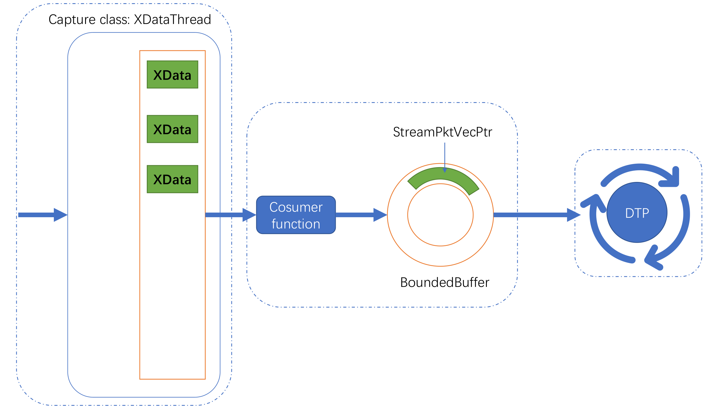
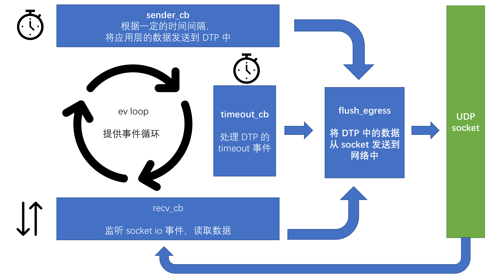
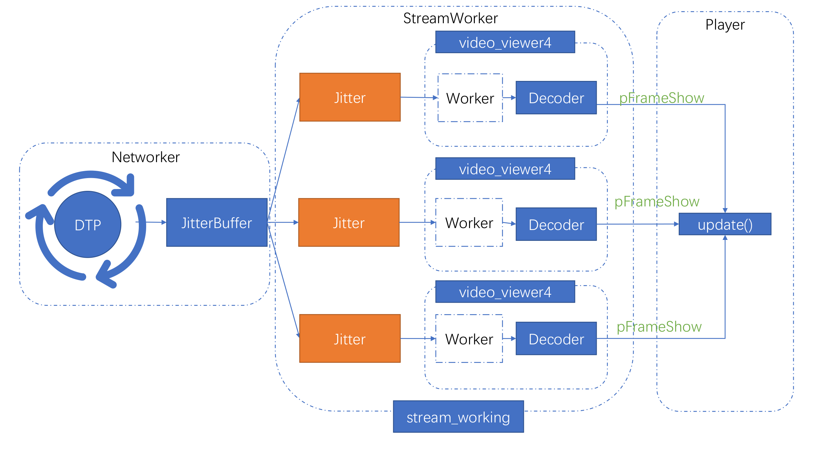

- [服务端程序](#sec-1)
  - [数据采集](#sec-1-1)
  - [数据打包](#sec-1-2)
  - [数据发送](#sec-1-3)
- [客户端程序](#sec-2)
  - [Networker](#sec-2-1)
  - [StreamWorker](#sec-2-2)
  - [Player](#sec-2-3)

直播系统主要分为两个部分，一个服务端程序，一个客户端程序。服务端程序负责采集音视频数据，将其编码封装成为数据块然后使用 DTP 协议进行传输。客户端则是负责使用 DTP 协议读取服务端发送的数据，将其缓存并且整序后进行解码和播放。

注：该文档中出现的部分数据结构以及类的概念详见“代码结构文档”中的说明

# 服务端程序

服务端程序由三个主要部分组成：

数据采集 <-> 数据打包 <-> 数据发送

每两个相连的组成部分都是一组生产者消费者模型。每个组成部分都由一个线程来负责执行。

## 数据采集

数据采集部分的主要工作是采集所需要的视频帧或是音频帧数据，并且将原始数据使用 XData 的方式储存在 XDataThread 类中。XDataThread 提供了一个异步的生产者消费者队列，使得其他线程可以从其中提取所需要的数据。一般来说，数据采集部分都会继承 XDataThread 类来实现生产者功能。

以直播的视频采集为例：

视频采集部分集中在 `live_liveCapture.h` 中。数据采集的启动线程在 `live_producer_consumer_func.h` 的 `live_produce` 函数中。

1.  `LiveCapture` 类继承 `XDataThread` 类，可以使用 Push() 储存 XData 数据并且对外提供 Pop() 接口来获得数据。
2.  LiveCapture 在启动后使用 OpenCV 采集视频帧数据。采集到的 RGB 视频帧以 XData 的方式，将原始数据储存在自身的队列中，之后可以被其他函数调用获取。

## 数据打包

数据打包部分的主要工作是将采集的原始数据进行处理和编码，形成 DTP 可以发送的单独的数据块，最终的数据会以 StreamPktVecPtr 的形式储存在 BoundedBuffer 类中。

以直播的视频采集为例：

视频数据的打包部分主要集中在 `live_producer_consumer_func.h` 的 `liveConsumeThread` 函数中。

1.  尝试从 LiveCapture 类中读取一个视频数据帧
2.  将视频帧进行类型转换并且编码
3.  将编码后的数据使用 FFmpeg 打包为 AVPacket 数据
4.  将 AVPacket 数据添加若干信息后打包形成 StreamPktVec 数据
5.  将 StreamPktVec 储存到 BoundedBuffer 中

## 数据发送

数据发送部分是将直播系统已经打包好的块数据使用 DTP 的 API 进行发送。DTP 提供了一套可以用于参考的样例收发程序，一般来说，只需要在“发送部分”实现相关的数据发送逻辑即可。这部分同时需要处理 DTP 在数据传输时所需要的“块截止时间”以及“块优先级”的相关任务。

有关 DTP 的具体收发逻辑的相关说明请查看 DTP 的相关说明文档。

一个简单的示意图如下：

# 客户端程序

客户端由三个部分组成，其中存在若干个线程来处理不同的事务。三个组成部分分别是：

-   Networker：处理数据包的接收和储存。主要在 `p_dtp_client.h` 中的 `dtp_client()` 函数进行执行。
-   StreamWorker：监听目前数据流的状态，生成线程来执行音视频的解码等工作。主要由 StreamWorker 类、 `video_viewer4()` 函数以及 `worker_cb4()` 函数进行处理。
-   Player：使用 SDL2 库进行视频的播放，解码后的数据到来时对画面进行更新，并且在屏幕上显示。主要由 `SDL_Play` 类进行处理。

## Networker

Networker 的组成和服务端的数据发送部分基本一致，只不过其不会主动发送数据，而是接收服务端发送的数据并且返回 ACK 信息，所以没有 `sender_cb` 。

Networker 会读取 DTP 接收到的数据块信息，并且根据块中记录的流的消息，将数据储存在 JitterBuffer 中。每一个 Jitter 代表一个视频流。

主要涉及的文件为 `p_dtp_client.h`

## StreamWorker

StreamWorker 通过 `stream_working` 函数监听当前所有的 Jitter 的状态。如果一个 Jitter 已经就绪，可以读取数据并且进行视频解码，则 StreamWorker 会为每一个 Jitter 新建一个线程以运行 `video_viewer4` 函数。在这里， Jitter 中的数据会被进行解码相关操作。

当 `video_viewer4` 完成解码器等结构的内存分配后，其会启动 `worker_cb4` 进行视频解码。

主要涉及的文件包括： `p_stream_worker.h` (stream\\working), `p_decode_video.h` (video\\viewer4, worker\\cb)

## Player

Player 在 `p_dtp_play.cxx` 中被初始化和启动。Player 会通过 `worker_cb4` 中得到的 `pFrameShow` 数据来更新画面，从而播放视频。

主要涉及的文件包括： `p_dtp_play.cxx`, `p_dtp_client.h`
